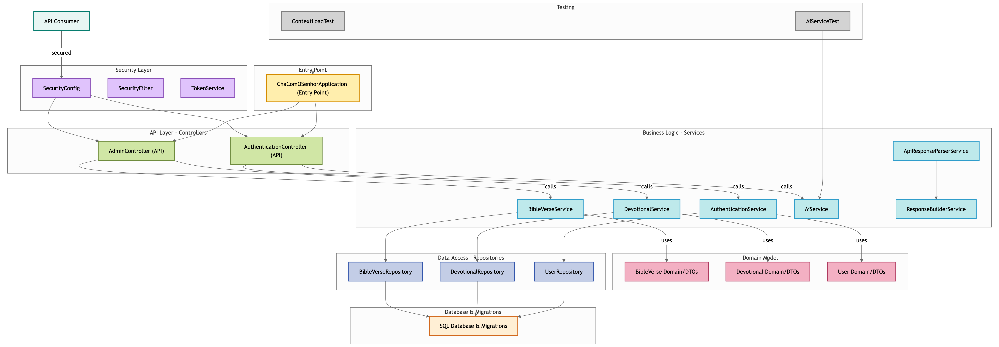

# ChaComOSenhor

## Overview
ChaComOSenhor is a Java-based application built with the Spring Boot framework. It includes scheduling capabilities and provides a REST API for managing users, Bible verses, devotionals, and testing AI services. The project uses Maven for dependency management and SQL for database operations.

## Features
- User management (CRUD operations)
- Bible verse management
- Devotional creation
- AI service testing
- Scheduling support

## Technologies Used
- **Java**: Core programming language
- **Spring Boot**: Framework for building the application
- **Maven**: Dependency and build management
- **PostgreSQL**: Database operations
- **IntelliJ IDEA**: Recommended IDE for development

## Structural Diagram of project



## Prerequisites
- Java 17 or higher
- Maven 3.8 or higher
- A running SQL database (e.g., MySQL, PostgreSQL)
- IntelliJ IDEA (optional but recommended)

## Getting Started

### Clone the Repository
```bash
git clone https://github.com/jgmacedo/ChaComOSenhor.git
cd ChaComOSenhor
```

### Configure the Application
1. Create an `application.properties` or `application.yml` file in the `src/main/resources` directory.
2. Add your database configuration:
   ```properties
   spring.datasource.url=jdbc:mysql://localhost:3306/your_database
   spring.datasource.username=your_username
   spring.datasource.password=your_password
   spring.jpa.hibernate.ddl-auto=update
   ```

### Build and Run the Application
1. Build the project:
   ```bash
   mvn clean install
   ```
2. Run the application:
   ```bash
   mvn spring-boot:run
   ```

### API Endpoints
Below are some of the key API endpoints:

#### User Management
- **Get All Users**: `GET /admin/users`
- **Delete User by ID**: `DELETE /admin/users/{id}`

#### Bible Verse Management
- **Get Bible Verse by ID**: `GET /admin/get_bible_verse_by_id/{id}`
- **Get All Bible Verses**: `GET /admin/get_all_bible_verses`
- **Create Bible Verse**: `POST /admin/create_bible_verse`

#### Devotional Management
- **Create Devotional**: `POST /admin/create_devotional/{id}`

#### AI Service
- **Test AI Service**: `GET /admin/test_ai_service/{id}`

### Example HTTP Requests
You can use tools like Postman or HTTP client files (e.g., `.http` files) to test the API. Example requests are provided in the `HTTP Test/test1.http` file.

## Development

### IDE Setup
1. Open the project in IntelliJ IDEA.
2. Ensure the Maven tool window is enabled.
3. Run the `ChaComOSenhorApplication` class to start the application.

### Running Tests
To execute tests, run:
```bash
mvn test
```

## Contributing
1. Fork the repository.
2. Create a new branch for your feature or bug fix.
3. Commit your changes and push the branch.
4. Open a pull request.

## License
This project is licensed under the MIT License. See the `LICENSE` file for details.

## Contact
For questions or support, contact the project maintainer at `jgmacedo`.